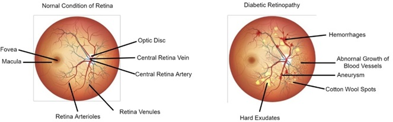
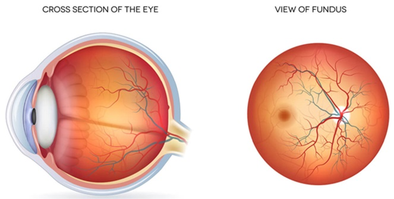

Jogging down some notes .. in nature sorting order:

### diabetic retinopathy (DR) severity: 
 Image credit: Nneji et al., 2022 (
    [local](../papers/Identification_of_dr_using_weight_fusion_dl.pdf), 
    [remote](https://www.mdpi.com/2075-4418/12/2/540)
)

DR severity has four classification levels:
1 : Mild nonproliferative DR. Small red dots on the retina in fundus image (known as microeurysms).
2 : Moderate nonproliferative DR. Fundus image has increased microeurysms + cotton wool spots + larger hemorrages
3 : Severe nonproliferative DR. Fundus image has extensive cotton wool spots + multiple hemorrages + retina having blue area (due to lack of blood supply known as ishemic area)
4 : Proliferative DR. Fundus image has blood vessels grow on retina surface + hemorrage in vitreous gel of the eye + retina detachement 

### fundus:
the inside back surface of the eye. It consists of retina, macula, optic disc, fovea, blood vessels. 
 Image credit: [All About Vision](https://www.allaboutvision.com/eye-care/eye-anatomy/fundus/)

- retina : a thin layer of tissue at the back of the eye. It itself has multiple layers (rods: low light detection; cones: color vision and details). Light entering the eye hits retina which it processes the light and sends electrical signal to the brain.  
- macula : a small area (pinhead) at the center of retina in the bacak of the eye. It's function is to provide sharp vision and color preception using cone cells (photoreceptors). On a fundus image, it is the gray area surrounding the dark spot. 
- fovea : a 1.5 mm^2 in diameter area attached to the retina at the back of the eye. It is also at the center of the macula. Its function is to produce clear and sharp vision, responsible for activities such as reading, writing, and facial regconition. Because fovea is at the center, it is directly in line with the visual axis of the eye, making imagines focused onto it and maximizing clarity. On an fundus image, it is the dark spot. 
- optic disc : a small area in retina where the eye's optic nerve comes together, exists the eye and connects to the brain. Optic disc is a blind spot as it does not have photoreceptors. Our vision does not see the blind spot since the other eye can cover for it and our brain processes them together. On a fundus image, it is the white/bright cirle usually 15 degree temporally from the fovea. 

